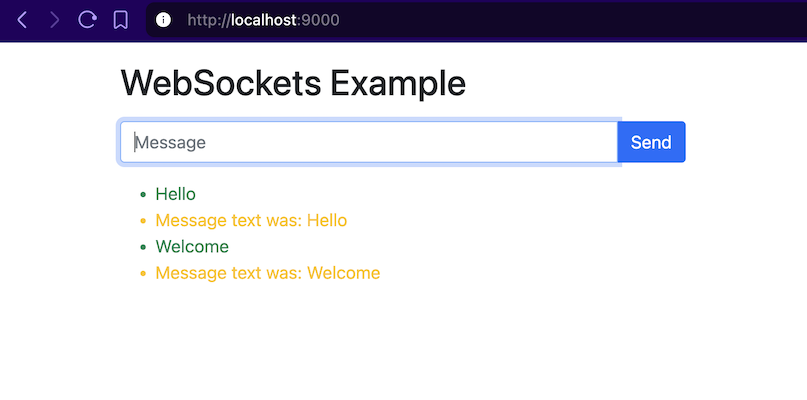

<h1 align="center">
  <br>
  
  <br>
  Web Sockets 
  <br>
</h1>

<h4 align="center">A minimal example of websockets based on Python FastAPI</h4>

&nbsp;

### Executing script

* The websockets server script is app.py and runs on localhost:
```
uvicorn app:app
```

* In another terminal window run the web server also on localhost:9000
```
python -m http.server 9000
```


## Documentation

You can find our documentation on our
[website](https://fastapi.tiangolo.com/advanced/websockets/)
